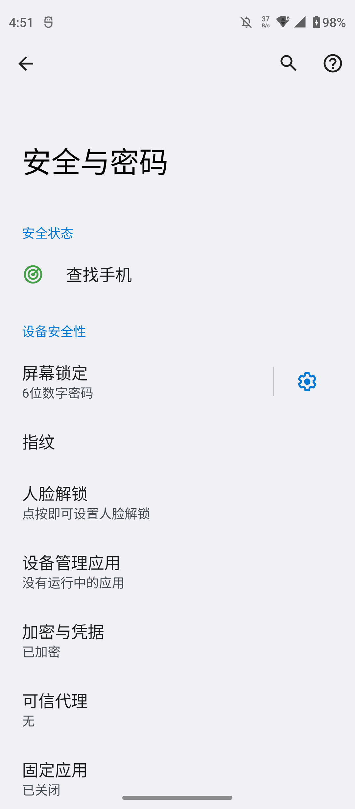
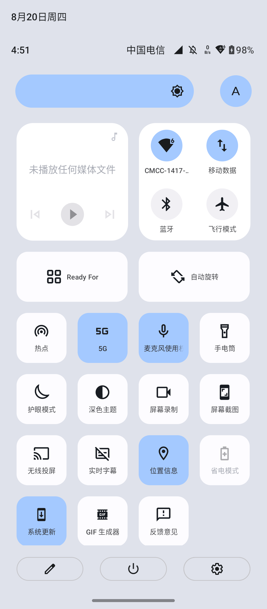
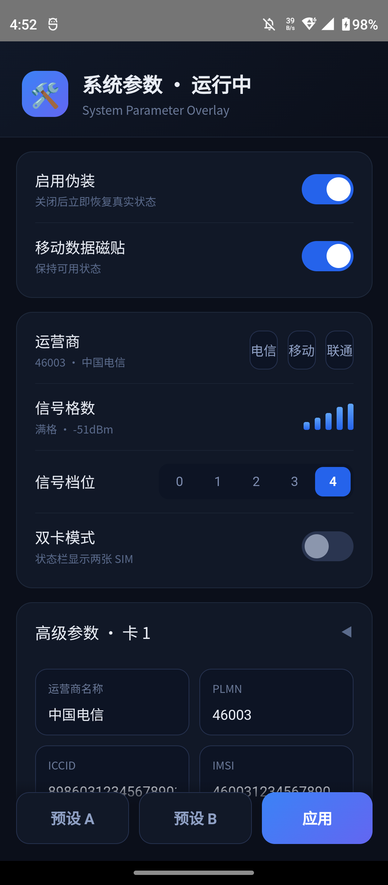

# CNSimSpoof

**无 SIM 卡也能让状态栏显示"中国电信 · 信号满格"的 LSPosed 模块。**

一个为无卡设备（备用机 / 平板 / 展示机）伪装完整移动网络状态的 Xposed 模块：运营商名称、信号格数、IMSI/ICCID/本机号、注册状态全部可控，并带一个开箱即用的深色配置 UI。插回真卡自动放行真实数据。



## 效果

| 快速设置（QS） | 模块配置界面 |
|:---:|:---:|
|  |  |

- 状态栏 / QS / 锁屏显示自定义运营商（默认 `中国电信`）
- 信号格 0–4 可调，ASU/dBm/注册状态联动（默认满格 `-51 dBm`）
- 对 `TelephonyManager` / `ServiceState` / `SignalStrength` / `SubscriptionManager` 全套查询拦截
- 双卡伪装（可配第二张卡的 PLMN / ICCID / IMSI）
- WebView 深色配置界面，改参数点"应用" **2–3 秒生效**（配置版本轮询，不依赖广播）
- 插入真卡自动探测（`sp_real`），插卡即恢复真实信号，无需卸载
- 附赠：屏蔽 Moto `com.motorola.setup` 的"未找到 SIM 卡"不可删除弹窗（appops 方案见 [docs](#常见问题)）

## 环境要求

- Android 12+（在 Moto Edge / My UX 上开发验证）
- Root（APatch / KernelSU / Magisk 均可）+ **LSPosed**（或其 fork）
- `adb`（安装、授权、首次激活）

## 安装

```bash
# 1. 安装 APK 并授权（关键：签名级权限，不授权则 UI 写配置全部静默失败）
adb install -r SysPref.apk
adb shell pm grant com.util.syspref android.permission.WRITE_SECURE_SETTINGS

# 2. 在 LSPosed 管理器中启用模块，作用域勾选「系统界面 (com.android.systemui)」

# 3. 软重启 SystemUI 完成注入（免重启整机）
adb shell su -c "kill $(adb shell pidof com.android.systemui)"
```

之后打开应用 `com.util.syspref`（launcher 名"系统偏好"）即可配置。

> **LSPosed 管理器打不开模块列表？**（部分 fork 的 ComposeActivity 自崩）可用 root 直接改 `/data/adb/lspd/config/modules_config.db` 的 `modules` 表：`enabled=1`、`apk_path` 填实际安装路径，再软重启 SystemUI。自动化脚本见 `scripts/deploy_v8c.py`（含 WAL 三件套处理与路径校正）。

## 从源码构建

纯 Java，无 Gradle 依赖，三条脚本直编：

```bash
pip install pillow   # 可选，仅截图校验用
python scripts/compile_dex.py   # javac -> d8 (classes.dex)
python scripts/aapt_build.py    # aapt 打包 + 注入 dex
python scripts/deploy_v8c.py    # 签名 -> 安装 -> 授权 -> DB 路径校正 -> 软重启 -> 验证
```

依赖：JDK 17+（javac / d8）、Android SDK 的 `android.jar`（API 34）与 build-tools `aapt`、`uber-apk-signer`。路径在脚本头部统一配置。

### 目录结构

```
app/
  src/com/util/syspref/
    Core.java    # hook 注册中心（kind 驱动）
    Hook.java    # 各类查询拦截回调
    Fill.java    # MobileSignalController.updateMobileStatus 前填充壳状态（信号格核心）
    Poll.java    # SystemUI 内配置版本轮询（即时生效核心）
    Killer.java  # 延迟自杀（避免广播分发中死亡触发 AMS 惩罚）
    Rv.java      # SYNC / SIM_STATE 广播接收
    Cfg.java     # Settings.Global 配置读写 + 订阅重建
    Ui.java/Js.java  # WebView 配置界面 + JS 桥
  stubs/         # 编译桩（Xposed API / ActivityThread），不进 dex
  assets/ui.html # 配置界面
scripts/         # 编译/打包/部署管线
```

## 常见问题

**Q: UI 点"应用"没反应？**
三个坑都踩过：① `WRITE_SECURE_SETTINGS` 没授权（签名级权限，`adb install -r` 后必须重新 `pm grant`）；② 广播带 receiverPermission 会被 AMS 静默丢弃；③ 接收进程在广播分发中自杀会触发 AMS 投递惩罚，后续广播不再送达。本模块的解法是 `Poll.java` 在 SystemUI 进程内每 2s 轮询 `sp_ver`/`sp_real`，变化即延迟自杀重载——不依赖广播，稳定 2–3s 生效。

**Q: 运营商名变了但信号格是空的？**
两处必须齐修：`ServiceState.getState()` 系列要拦回 `IN_SERVICE(0)`；且无真卡时 `MobileSignalController` 的 `mServiceState`/`mSignalStrength` 恒为 null（phone 进程只对 subId=-1 上报），getter hook 拦不到 null——需要在 `updateMobileStatus(MobileStatus)` 入口把 null 字段填成壳对象（见 `Fill.java`）。

**Q: "未找到 SIM 卡"通知删不掉？**
Moto 的 `com.motorola.setup` 用 HIGH 渠道 + `mBlockableSystem=false`，用户侧无法关闭。根治：
```bash
adb shell su -c "cmd appops set com.motorola.setup POST_NOTIFICATION ignore"
adb shell su -c "am force-stop com.motorola.setup"
```

**Q: 伪装会影响真实通话/流量吗？**
不会建立任何真实网络连接；QS 的"移动数据"磁贴切换的只是 UI 状态。插回 SIM 卡后模块自动放行真实数据。

## 配置键（Settings.Global）

| 键 | 含义 | 默认 |
|---|---|---|
| `sp_on` | 总开关（0=全部放行真实值） | 1 |
| `sp_real` | 真卡在位标志（自动维护） | 0 |
| `sp_lv` | 信号格 0–4 | 4 |
| `sp_dual` | 双卡伪装 | 0 |
| `sp_n1/sp_p1/sp_i1/sp_m1/sp_t1` | 运营商名 / PLMN / ICCID / IMSI / 本机号 | 中国电信 / 46003 / 8986... / 46003... / +861**** |
| `sp_ver` | 配置版本号（apply 时 +1，Poll 监听） | - |

## 免责声明

仅供自有设备的界面定制 / 开发调试 / 展示用途。请勿用于欺诈或绕过运营商实名校验。插入真实 SIM 卡时模块自动放行真实数据。

## 致谢

- 改造起点：[USAspoof](https://github.com/nicklhw/USAspoof)（思路与 TelephonyManager hook 骨架）
- [LSPosed](https://github.com/LSPosed/LSPosed) 团队的 Xposed API
